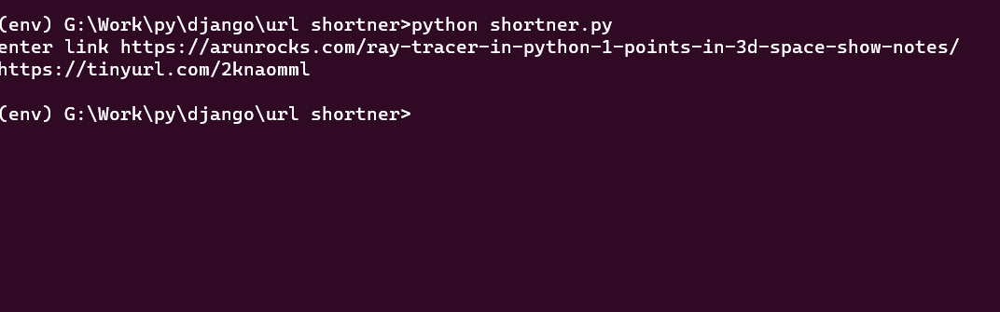

# Shorten Any URL

## Purpose

The purpose of this script is to shorten any URL

## Short description of package/script

This script takes a URL and returns shortened URL which can be used to navigate to the original link.

## Workflow of the Project

- this script utilizes pyshorteners module to shorten the URL
- just input the URL after running the script
- the script will return the shortened URL

## Setup instructions

- Install the dependencies using `pip install -r requirements.txt`
- Open command prompt run `python shortener.py`
- Supply the URL to be shortened
- the script will return the shortened URL

## Compilation Steps

- Open the python script code in any of your IDE.
- Follow the above mentioned Setup Instructions.

## Output

## Author

[Vivek](https://github.com/vivekthedev)